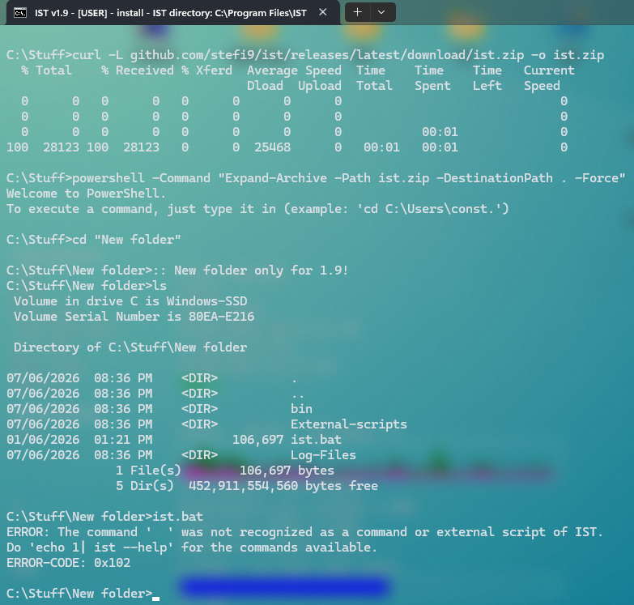
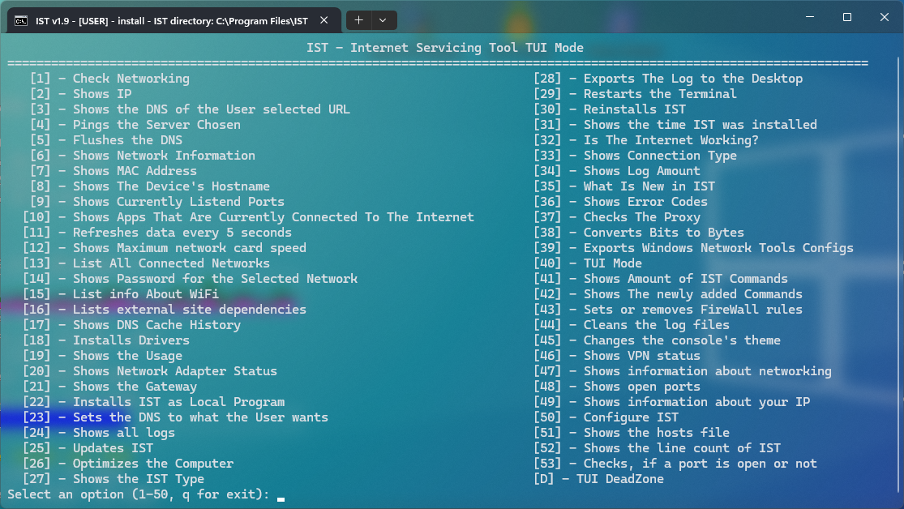
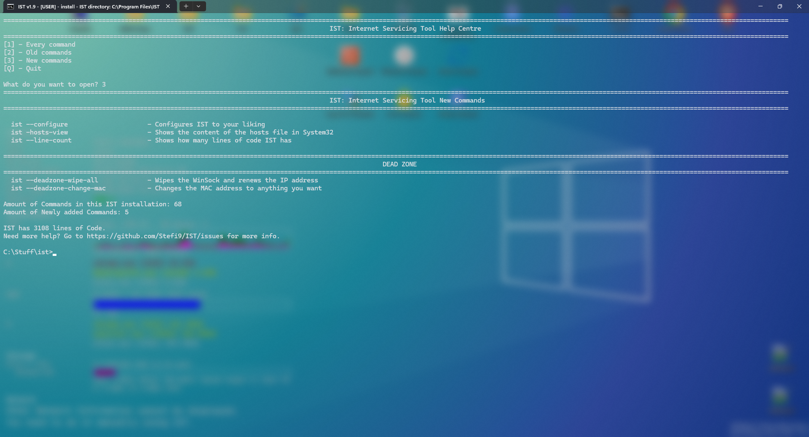

# IST (also known as Internet Servicing Tool) is a free and open-source batch script designed to do network based tasks. Like "ist -check-network" for checking download and upload speed. or "ist -ip" to show the ip address and many more.

## Technical/legal information:
The license of the GitHub repo and anything inside is MIT. More information in the license file.

The current version of IST as of the time of this file, is 1.9. Released June 1st of 2026.
## Q&A:
Q: How do I download IST?
A: Open the terminal and type the following.
```cmd
curl -L github.com/stefi9/ist/releases/latest/download/ist.zip -o ist.zip
powershell -Command "Expand-Archive -Path ist.zip -DestinationPath . -Force"
```


Q: What does IST do?
A: IST is not just a little program anymore, it's an entire Ecosystem of it. You can do the basics, a quick and dirty speedtest, a view of the hosts file or a view of your IP address (with a prompt) to DeadZone commands like --deadzone-renew, which makes a new IP address or --deadzone-reset-arp, which reset's ARP (also known as Address Resolution Protocol) and more. IST is even educational too. Using command -networking-tips, you can get, well... networking tips. Like, what does VPN stand for? Virtual Private Network. Or as demonstrated before, ARP = Address Resolution Protocol.

Q: How do I update IST?
A: There are 2 primary ways:
Method 1:
You go to github and download the latest version of IST
Method 2:
If your IST version is over v1.6, just do ist --update in the terminal.

Q: Can you edit IST's source code?
A: Absolutely! Just download the version of IST you want to change the source code, right click the bat file and click "Edit in Notepad" and there you can edit the source code. Since IST is Open Source, anyone has access to its source code.

Q: What are the minimum system requirements for IST?
A: This is going to be true for every version. But, these are the system requirements:
- An active Internet connection (if not, why do you have IST?)
- A 64-Bit Windows version with NT version 10 (Windows 10 and later)
- PowerShell (built-in PowerShell, not pwsh)
- cmd.exe (for the actual executor of IST)

Not required, but recommended:
- Administrator access (for DeadZone commands and some network operations)
- WinGet (for driver installation via -install-drivers)

Q: Since it's FaOSS, how can people do {blank}?
A: Depending on the thing, do these things:
- Issues?
Issues tab in this GitHub repo.
- Fork?
Just fork this repo.
- Pull Requests?
Just do them on this repo.
Summary: Just do everything on this repo.

Q: Except this README, where else can I get information about IST?
A: On my website stefi9.github.io/ I have a IST section for primarily IST stuff. Here will be more information.

Q: Is IST safe?
A: For malware? No. It isn't malware nor it downloads malware. Just in case, if the """IST""" you downloaded is/has malware, report the site you got it from, because IST never has or is malware. For usage, like hacking? Maybe? It has some things, like if you have a public IP address, you can see the location of it, that the internet found the IP's on. Or you can save your IP address as a file and a bad person rips the code for the decryptor of the ipAddress.ist file and just do it in the terminal, they have access to the IP address.
Summary: Yesn't?

Q: Is this the end of the README?
A: Kind of, you reached the end of the Q&A. There might still be things on its way.

## Showcases:



Back to the question, now the README ended.